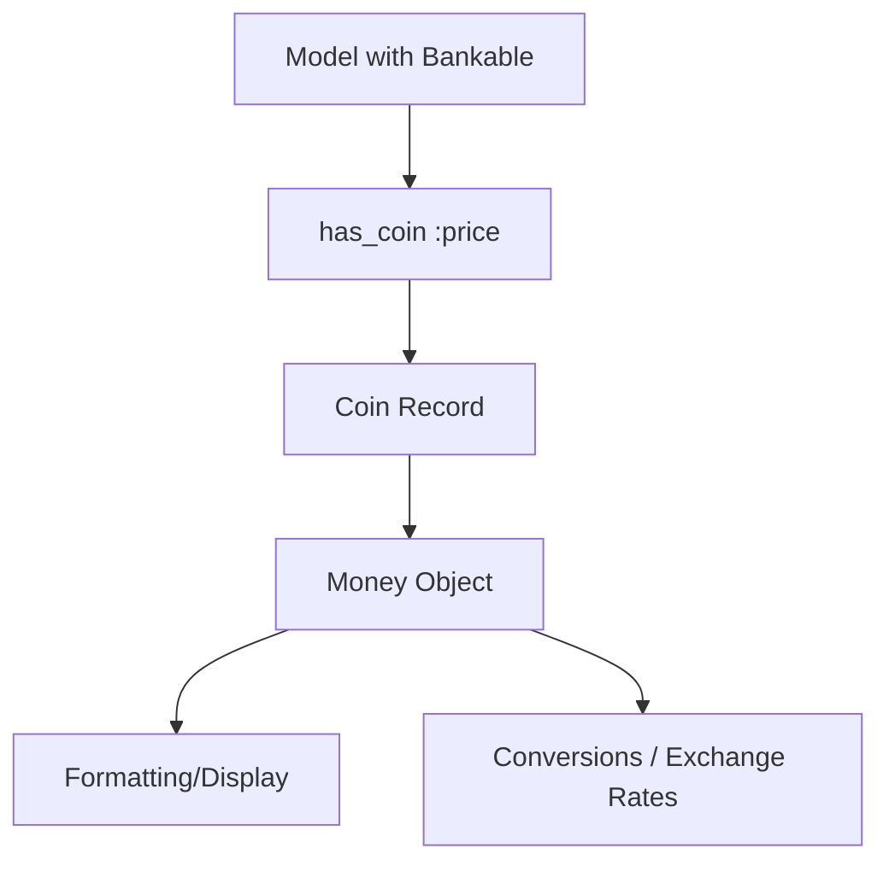

# WhittakerTech::Midas

[](MIT-LICENSE)
[]()
[]()

A Rails engine for elegant monetary value management with multi-currency support. Midas provides a single source of truth for all currency values in your application, eliminating schema bloat and unifying currency behavior.

## Why I Made Midas
Midas was created because monetization code becomes one of the most fragile parts of a Rails application.
Teams duplicate currency logic across dozens of models, leading to rounding inconsistencies, schema bloat, and costly refactors during growth phases.
Midas centralizes all monetary behavior into a single, predictable source of truth.
This design keeps your pricing, billing, and financial reporting consistent across the entire system.

## Key Capabilities

- Single canonical `Coin` model as a unified monetary ledger
- Declarative monetary attributes via `has_coin` and `has_coins`
- Money-safe arithmetic backed by RubyMoney’s precision library
- Automatic minor-unit conversion for all input types (int, float, Money)
- Multi-currency support with configurable exchange rates
- Headless currency input UI for form builders
- Test suite with >90% coverage
- Zero schema duplication&mdash;no proliferation of `_cents` columns

## Requirements

- Ruby 3.4+
- Rails 7.1+
- money gem ~> 6.19.0

## Installation

Add to your `Gemfile`:
```ruby
gem 'whittaker_tech-midas', path: 'engines/whittaker_tech-midas'
```

Install and run migrations:
```bash
bundle install
bin/rails railties:install:migrations FROM=whittaker_tech_midas
bin/rails db:migrate
```

This creates the `wt_midas_coins` table.

## Quick Start

### 1. Include Bankable in Your Model
```ruby
class Product < ApplicationRecord
  include WhittakerTech::Midas::Bankable
  
  has_coins :price, :cost, :msrp
end
```

### 2. Set Monetary Values
```ruby
product = Product.create!

# From float (dollars)
product.set_price(amount: 29.99, currency_code: 'USD')

# From Money object
product.set_price(amount: Money.new(2999, 'USD'), currency_code: 'USD')

# From integer (cents)
product.set_price(amount: 2999, currency_code: 'USD')
```

### 3. Access Values
```ruby
product.price              # => Coin object
product.price_amount       # => Money object (#<Money @cents=2999 @currency="USD">)
product.price_format       # => "$29.99"
product.price_in('EUR')    # => "€26.85" (if exchange rates configured)
```

## Usage Guide

### The Coin Model

Every monetary value is stored as a `Coin` with:
- `resource_type` / `resource_id`: Polymorphic association to parent
- `resource_label`: Identifies which money attribute (e.g., "price")
- `currency_code`: ISO 4217 code (USD, EUR, JPY, etc.)
- `currency_minor`: Integer value in minor units (cents, pence)

### The Bankable Concern

Include `Bankable` to add monetary attributes to any model:
```ruby
class Invoice < ApplicationRecord
  include WhittakerTech::Midas::Bankable
  
  has_coins :subtotal, :tax, :total
end
```

#### Single Coin
```ruby
has_coin :price
has_coin :deposit, dependent: :nullify  # Custom dependency
```

#### Multiple Coins
```ruby
has_coins :subtotal, :tax, :shipping, :total
```

### Generated Methods

For each `has_coin :price`, you get:

| Method | Returns | Example |
|--------|---------|---------|
| `price` | Coin object | `product.price` |
| `price_coin` | Coin association | `product.price_coin` |
| `price_amount` | Money object | `Money<2999 USD>` |
| `price_format` | Formatted string | `"$29.99"` |
| `price_in(currency)` | Formatted conversion | `"€26.85"` |
| `set_price(amount:, currency_code:)` | Creates/updates coin | Returns Coin |
| `midas_coins` | All coins on resource | `product.midas_coins.count` |

### Currency Input Field (UI)

Midas provides a headless Stimulus-powered currency input with bank-style typing:
```erb
<%= form_with model: @product do |f| %>
  <%= midas_currency_field f, :price,
        currency_code: 'USD',
        label: 'Product Price',
        wrapper_html: { class: 'mb-4' },
        input_html: { 
          class: 'rounded-lg border-gray-300 text-right',
          placeholder: '0.00'
        } %>
  
  <%= f.submit %>
<% end %>
```

**Bank-Style Typing:**
User types `1234` → displays as `0.01` → `0.12` → `1.23` → `12.34`

**Features:**
- Automatic decimal handling based on currency
- Hidden field stores minor units (cents)
- Style with Tailwind, Bootstrap, or custom CSS
- Backspace removes rightmost digit

### Currency Configuration

Define currency-specific settings via I18n:
```yaml
# config/locales/midas.en.yml
en:
  midas:
    ui:
      defaults:
        decimal_count: 2
      currencies:
        USD:
          decimal_count: 2
          symbol: "$"
        JPY:
          decimal_count: 0
          symbol: "¥"
        BTC:
          decimal_count: 8
          symbol: "₿"
```

### Money Gem Configuration

Configure Money gem behavior (recommended):
```ruby
# config/initializers/money.rb
Money.locale_backend = nil  # or :i18n for i18n support
Money.default_bank = Money::Bank::VariableExchange.new
Money.rounding_mode = BigDecimal::ROUND_HALF_EVEN

Money.default_formatting_rules = {
  display_free: false,
  with_currency: false,
  no_cents_if_whole: false,
  format: '%u%n',  # symbol before amount
  thousands_separator: ',',
  decimal_mark: '.'
}
```

### Exchange Rates

Set up exchange rates for currency conversion:
```ruby
# In your app
Money.default_bank.add_rate('USD', 'EUR', 0.85)
Money.default_bank.add_rate('EUR', 'USD', 1.18)

# Now conversions work
product.price_in('EUR')  # Automatic conversion
```

For production, integrate with an exchange rate API:
- [eu_central_bank](https://github.com/RubyMoney/eu_central_bank)
- [money-open-exchange-rates](https://github.com/spk/money-open-exchange-rates)
- [google_currency](https://github.com/RubyMoney/google_currency)

## Advanced Usage

### Multiple Coins on One Resource
```ruby
order = Order.create!
order.set_subtotal(amount: 100.00, currency_code: 'USD')
order.set_tax(amount: 8.50, currency_code: 'USD')
order.set_total(amount: 108.50, currency_code: 'USD')

order.midas_coins.count  # => 3
```

### Mixed Currencies
```ruby
order.set_subtotal(amount: 100, currency_code: 'USD')
order.set_shipping(amount: 850, currency_code: 'EUR')

order.subtotal_format     # => "$100.00"
order.shipping_format     # => "€8.50"
order.shipping_in('USD')  # => "$10.00" (with exchange rate)
```

### Working with Coin Objects Directly
```ruby
coin = product.price
coin.currency_code        # => "USD"
coin.currency_minor       # => 2999
coin.amount               # => Money object
coin.amount.format        # => "$29.99"
coin.exchange_to('EUR')   # => Money object in EUR
coin.format(to: 'EUR')    # => "€26.85"
```

### Validations
```ruby
class Product < ApplicationRecord
  include WhittakerTech::Midas::Bankable
  has_coin :price
  
  validate :price_must_be_positive
  
  private
  
  def price_must_be_positive
    if price_amount && price_amount.cents <= 0
      errors.add(:price, "must be positive")
    end
  end
end
```

## Architecture



### Why This Design?

**Problem:** Traditional Rails apps duplicate currency logic everywhere:
```ruby
# ❌ Schema bloat - every model needs these columns
add_column :products, :price_cents, :integer
add_column :products, :price_currency, :string
add_column :invoices, :subtotal_cents, :integer
add_column :invoices, :subtotal_currency, :string
# ...repeated dozens of times
```

**Solution:** Midas uses a polymorphic `Coin` model as a single source of truth:
```ruby
# ✅ One table, unlimited monetary attributes
create_table :wt_midas_coins do |t|
  t.references :resource, polymorphic: true
  t.string :resource_label  # "price", "cost", "tax", etc.
  t.string :currency_code
  t.integer :currency_minor
end
```

### Database Schema
```
┌─────────────────────────────────────┐
│       wt_midas_coins                │
├─────────────────────────────────────┤
│ id                    BIGINT        │
│ resource_type         STRING        │ ─┐
│ resource_id           BIGINT        │ ─┤ Polymorphic
│ resource_label        STRING        │ ─┘
│ currency_code         STRING(3)     │
│ currency_minor        BIGINT        │
│ created_at            TIMESTAMP     │
│ updated_at            TIMESTAMP     │
└─────────────────────────────────────┘
         ▲
         │ has_many :midas_coins
         │
┌────────┴─────────┐
│  Any Model with  │
│     Bankable     │
└──────────────────┘
```

## Testing

Run the full test suite:
```bash
cd engines/whittaker_tech-midas
bundle exec rspec
```

With coverage report:
```bash
COVERAGE=true bundle exec rspec
open coverage/index.html
```

Current coverage: **90%+**

## Development

### Setup
```bash
cd engines/whittaker_tech-midas
bundle install
cd spec/dummy
bin/rails db:create db:migrate
```

### Dummy App

Test the engine manually:
```bash
cd spec/dummy
bin/rails server
# Visit http://localhost:3000
```

### Adding New Features

1. Write tests first in `spec/`
2. Implement in `app/`
3. Update README
4. Run `bundle exec rspec`
5. Check coverage with `COVERAGE=true bundle exec rspec`

## Troubleshooting

### Exchange rates not working

Make sure you've configured exchange rates:
```ruby
Money.default_bank.add_rate('USD', 'EUR', 0.85)
```

### Input field not formatting

Check that Stimulus is loaded and the controller is registered:
```javascript
import { MidasCurrencyController } from "whittaker_tech-midas"
application.register("midas-currency", MidasCurrencyController)
```

### Coin not persisting

Ensure the parent record is saved before setting coins:
```ruby
product = Product.create!  # Must be persisted
product.set_price(amount: 29.99, currency_code: 'USD')
```

## Roadmap

- [ ] Install generator (`rails g midas:install`)
- [ ] Add coins generator (`rails g midas:add_coins Product price cost`)
- [ ] Built-in exchange rate fetching
- [ ] Coin versioning for audit trails
- [ ] ViewComponent integration
- [ ] Stripe/LemonSqueezy integration examples

## Contributing

1. Fork the repository
2. Create your feature branch
3. Write tests
4. Implement your feature
5. Submit a pull request

## License

MIT License. See [MIT-LICENSE](MIT-LICENSE) for details.

## Credits

Built by WhittakerTech

Powered by:
- [Money gem](https://github.com/RubyMoney/money)
- [Rails](https://rubyonrails.org/)
- [Stimulus](https://stimulus.hotwired.dev/)
