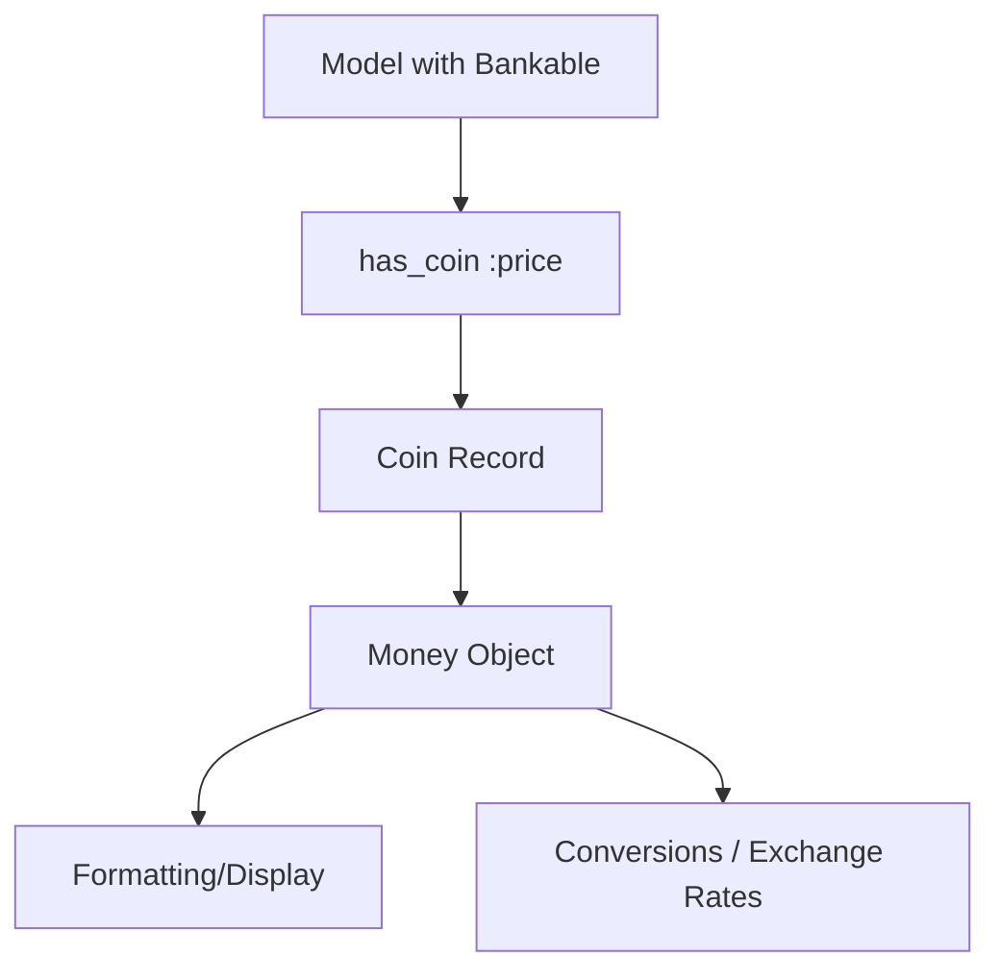

# Architecture

Midas centralizes monetary values in one polymorphic ledger:

```mermaid
graph TD
  A[Model with Bankable] --> B[has_coin :price]
  B --> C[Coin Record]
  C --> D[Money Object]
  D --> E[Formatting/Display]
  D --> F[Conversions / Exchange Rates]
```